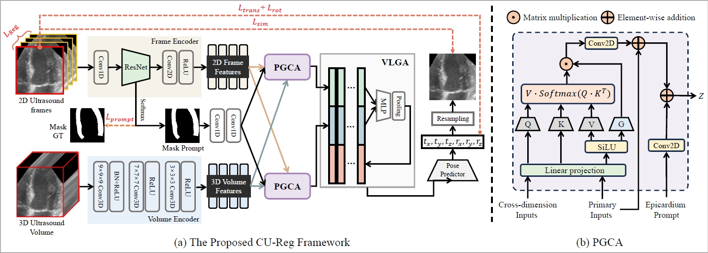

# [MICCAI'24] Epicardium Prompt-guided Real-time Cardiac Ultrasound Frame-to-volume Registration

<p align="center">

</p>

Official Implementation of "[Epicardium Prompt-guided Real-time Cardiac Ultrasound Frame-to-volume Registration]()"

[Long Lei](https://scholar.google.com/citations?user=yB7qfigAAAAJ&hl=zh-CN&oi=ao), [Jun Zhou](https://scholar.google.com/citations?hl=zh-CN&user=pEgMa-UAAAAJ), [Jialun Pei*](https://scholar.google.com/citations?user=1lPivLsAAAAJ&hl=en), [Baoliang Zhao](https://scholar.google.com/citations?hl=zh-CN&user=e1Z-HpgAAAAJ), [Yueming Jin](https://yuemingjin.github.io/), [Yuen-Chun Jeremy Teoh](https://www.med.cuhk.edu.hk/staff/dr-teoh-yuen-chun-jeremy), [Jing Qin](https://harry-qinjing.github.io/), and [Pheng-Ann Heng](https://scholar.google.com/citations?user=OFdytjoAAAAJ&hl=zh-CN)

[[Paper]](); [Official Version]()

**Contact:** longlei@cuhk.edu.hk, peijialun@gmail.com

## Installation
**Conda virtual environment**

We recommend using conda to setup the environment.

If you have already installed conda, please use the following commands.

```bash
conda create -n CU-Reg python=3.8
conda activate CU-Reg
pip install -r requirements.txt
```

## Dataset
Download the processed CAMUS dataset, you can download it [here](https://drive.google.com/drive/folders/1dln50wujTLGQW0tTM5HibSdF7ZYrWRsM?usp=drive_link).

## Evaluation
Please download our trained model [here](https://github.com/junzastar/CU-Reg.git) and put it in the 'experiments/trained_models' directory. Then, you can have a quick evaluation using the following command.
```bash
python test.py
```

## Train
In order to train the model, remember to download the complete dataset.

train.py is the main file for training. You can simply start training using the following command.
```bash
python train.py
```

## Citation
If you find the code useful, please cite our paper.
```latex

```

## Acknowledgment
Our code is developed based on [FVR-Net](https://github.com/DIAL-RPI/FVR-Net.git).
